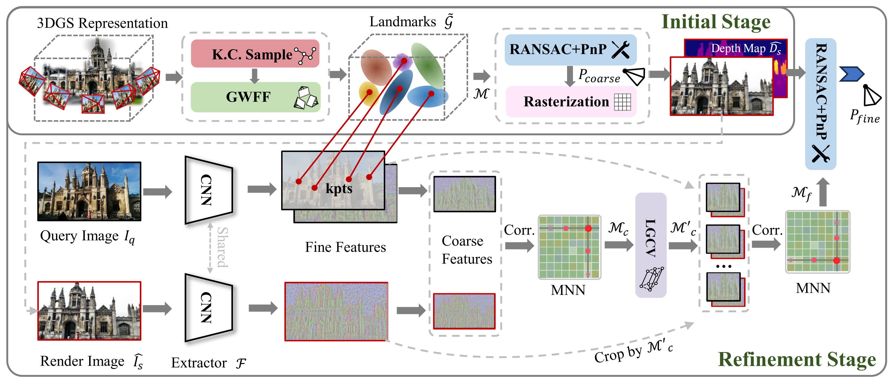

<div align="center">
<h1>ULF-Loc: Unbiased Landmark Feature for Robust Visual Localization with 3D Gaussian Splatting</h1>

<a href="https://arxiv.org/abs/2605.04730" target="_blank" rel="noopener noreferrer">
  
</a>
<a href="" target="_blank">
  
</a>
<a href="https://github.com/Cyril-gyd/ULF-Loc" target="_blank">
  
</a>
<a href="https://github.com/Cyril-gyd/ULF-Loc" target="_blank"></a>

[Yingdong Gu](https://github.com/Cyril-gyd)<sup>1*</sup> &nbsp;
[Shaocheng Yan](https://laka-3dv.github.io/)<sup>1*</sup> &nbsp;
[Zhenjun Zhao](https://ericzzj1989.github.io/)<sup>2</sup> &nbsp;
[Yuan Kou](#)<sup>3,4</sup> &nbsp;
<br>
[Jianxin Luo](#)<sup>3,4</sup> &nbsp;
[Pengcheng Shi](https://shipc-ai.github.io/)<sup>1</sup> &nbsp;
[Jiayuan Li](https://jszy.whu.edu.cn/lijiayuan1/zh_CN/index.htm)<sup>1&dagger;</sup>
<br>

<sup>1</sup>Wuhan University &emsp; <sup>2</sup>University of Zaragoza &emsp; <br><sup>3</sup>The First Surveying and Mapping Institute of Hunan Province &emsp; <br><sup>4</sup>The Hunan Engineering Research Center of 3D Real Scene Construction and Application Technology
<br>
<sup>*</sup> Equal Contribution &emsp; <sup>&dagger;</sup> Corresponding Authors

</div>

## 🌀 Overview

<p align="center">
  
  <br>
  <em>ULF-Loc constructs Unbiased Landmark Features via Keypoint-Consensus Sampling and Geometry-Weighted Feature Fusion, fundamentally solving the inherent bias in alpha-blending, achieving highly accurate and ultra-efficient visual localization.</em>
</p>


## 📰 News
- **[2026-05-09]** Our code is now released! 🎉
- **[2026-05-07]** ULF-Loc paper is available on [arXiv](https://arxiv.org/abs/2605.04730).🎉
- **[2026-04-09]** Our paper is accepted by CVPR 2026 as a **Highlight** paper! 🌟


## 🛠️ Installation

We recommend using `conda` to manage the environment. Our code is tested with Python 3.8 and PyTorch 2.4.1 with CUDA 11.8.

```bash
# Clone the repository
git clone --recursive https://github.com/Cyril-gyd/ULF-Loc.git
cd ULF-Loc

# Create conda environment
conda create -n ulfloc python=3.8 -y
conda activate ulfloc

# Install PyTorch
pip install torch==2.4.1 torchvision==0.19.1 torchaudio==2.4.1 --index-url https://download.pytorch.org/whl/cu118

# Install dependencies
pip install -r requirements.txt

# Install submodules 
pip install submodules/simple-knn
```


## 📚 Data Preparation

We evaluate our method on three standard public datasets:

- [Microsoft 7-Scenes](https://www.microsoft.com/en-us/research/project/rgb-d-dataset-7-scenes/)
- [12Scenes](https://graphics.stanford.edu/projects/reloc/)
- [Cambridge Landmarks](https://www.repository.cam.ac.uk/handle/1810/251342/)

For 7-Scenes and 12-Scenes, we experimented with Pseudo Ground Truth (PGT) camera poses obtained after running SfM on the scenes.

Please organize the downloaded datasets in the `datasets/` directory following this structure:
```text
datasets/
├── 7scenes/
│   ├── chess/
│   ├── fire/
|   ├── ...
│   └── 7scenes_reference_models/
├── 12scenes/
│   ├── apt1/
│   ├── apt2/
|   ├── ...
│   └── 12scenes_reference_models/
└── cambridge/
    ├── KingsCollege/
    └── ...
```

### 7-Scenes Dataset
Download the images from the [7Scenes project page](https://www.microsoft.com/en-us/research/project/rgb-d-dataset-7-scenes/):
```bash
export dataset=datasets/7scenes
for scene in chess fire heads office pumpkin redkitchen stairs; \
do wget http://download.microsoft.com/download/2/8/5/28564B23-0828-408F-8631-23B1EFF1DAC8/$scene.zip -P $dataset \
&& unzip $dataset/$scene.zip -d $dataset && unzip $dataset/$scene/'*.zip' -d $dataset/$scene; done
```
Download full reconstructions
   from [visloc_pseudo_gt_limitations](https://github.com/tsattler/visloc_pseudo_gt_limitations/tree/main?tab=readme-ov-file#full-reconstructions):

```bash
gdown 1ATijcGCgK84NKB4Mho4_T-P7x8LSL80m -O $dataset/7scenes_reference_models.zip
unzip $dataset/7scenes_reference_models.zip -d $dataset
```

### 12-Scenes Dataset

Download the images from the [Stanford 12 Scenes project page](https://graphics.stanford.edu/projects/reloc/):

```bash
export dataset=datasets/12scenes
export scenes=( "apt1" "apt2" "office1" "office2" )
for scene in "${scenes[@]}"; do
  wget http://graphics.stanford.edu/projects/reloc/data/${scene}.zip -P $dataset
  unzip $dataset/${scene}.zip -d $dataset
  unzip $dataset/${scene}/'*.zip' -d $dataset/${scene}
  rm $dataset/${scene}.zip
done
```

Download full reconstructions from [visloc_pseudo_gt_limitations](https://github.com/tsattler/visloc_pseudo_gt_limitations/tree/main?tab=readme-ov-file#full-reconstructions):

```bash
gdown 1u5du-cYp3J3-BfybZVkhvgv0PPua8tud -O $dataset/12scenes_reference_models.zip
unzip $dataset/12scenes_reference_models.zip -d $dataset
rm $dataset/12scenes_reference_models.zip
```

### Cambridge Landmarks Dataset

Download images from [project page](https://www.repository.cam.ac.uk/handle/1810/251342/):

```bash
export dataset=datasets/cambridge
export scenes=( "KingsCollege" "OldHospital" "StMarysChurch" "ShopFacade" "GreatCourt" )
export IDs=( "251342" "251340" "251294" "251336" "251291" )
for i in "${!scenes[@]}"; do
wget https://www.repository.cam.ac.uk/bitstream/handle/1810/${IDs[i]}/${scenes[i]}.zip -P $dataset \
&& unzip $dataset/${scenes[i]}.zip -d $dataset ; done
```
For dynamic outdoor scenes, we use [Mask2Former](https://github.com/facebookresearch/Mask2Former) to remove dynamic objects and sky regions as described in the paper. 
```bash
cd submodules/Mask2Former
pip install -r requirements.txt
python -m pip install 'git+https://github.com/facebookresearch/detectron2.git'
cd mask2former/modeling/pixel_decoder/ops
sh make.sh
cd ../../../..
# download model
wget https://dl.fbaipublicfiles.com/maskformer/mask2former/coco/panoptic/maskformer2_swin_large_IN21k_384_bs16_100ep/model_final_f07440.pkl
cd ../..

# preprocess cambridge
bash scripts/dataset_preprocess.sh
```

## ⚡️ Quick Start

### 1. Construct Unbiased Landmark Features
Train the 3DGS model and apply K.C. Sampling and GWFF:

```bash
# For 7scenese (e.g., heads scene)
python train.py -s datasets/7scenes/7scenes_reference_models/heads -m outputs/7scenes/heads --iterations 30000 --data_device cpu -f sp -g 3dgs --sample_kpts --images  ../../heads --cfg  configs/ulfloc_7scenes.yaml

# use the script
bash scripts/train_7scenes.sh
bash scripts/train_12scenes.sh
bash scripts/train_cambridge.sh
```

### 2. Camera Localization (Inference)
Run the coarse-to-fine localization pipeline:

```bash
# For 7Scenes (e.g., heads scene)
python ulfloc.py -s datasets/7scenes/7scenes_reference_models/heads -m outputs/7scenes/heads --data_device cpu --images ../../heads --cfg configs/ulfloc_7scenes.yaml --longest_edge 640

# use the script
bash scripts/evaluate_7scenes.sh
bash scripts/evaluate_12scenes.sh
bash scripts/evaluate_cambridge.sh
```


## 📈 Performance Comparison

A brief comparison of ULF-Loc with existing 3DGS-based localization methods on the **Cambridge Landmarks** dataset:

<div align="center">

| Methods | Avg. Error &darr;(cm / &deg;) | Recall.↑[15cm/5°] | Recall.↑[10cm/5°] |
| :--- | :---: | :---: | :---: |
| HLoc(SP+SG)  | 11.0/0.21 | 64.8 | 52.0 |
| ACE  | 17/0.3 | 43.1 | 31.5 |
| GLACE  | 12/0.3 | 62.8 | 47.6 |
| STDLoc | 10.1/0.14 | 70.8 | 59.9 |
| GLACE+GS-CPR | 12/0.28 | 65.5 | 50.7 |
| ACE+GS-CPR | 15/0.33 | 56.8 | 42.6 |
| **ULF-Loc (Ours)** 🎖 | **8.3/0.13** | **72.0** | **62.2** |


</div>


## 📖 Citation

If you find our work or code useful, please consider citing our paper:

```bibtex
@misc{gu2026ulflocunbiasedlandmarkfeature,
      title={ULF-Loc: Unbiased Landmark Feature for Robust Visual Localization with 3D Gaussian Splatting}, 
      author={Yingdong Gu and Shaocheng Yan and Zhenjun Zhao and Yuan Kou and Jianxin Luo and Pengcheng Shi and Jiayuan Li},
      year={2026},
      eprint={2605.04730},
      archivePrefix={arXiv},
      primaryClass={cs.CV},
      url={https://arxiv.org/abs/2605.04730}, 
}
```

## 👏 Acknowledgements

This project is built upon several excellent open-source works. We sincerely thank the authors of:
- [3DGS (3D Gaussian Splatting)](https://github.com/graphdeco-inria/gaussian-splatting)
- [STDLoc](https://github.com/zju3dv/STDLoc)
- [SuperPoint](https://github.com/magicleap/SuperPointPretrainedNetwork) 
- [PoseLib](https://github.com/vlarsson/PoseLib)
